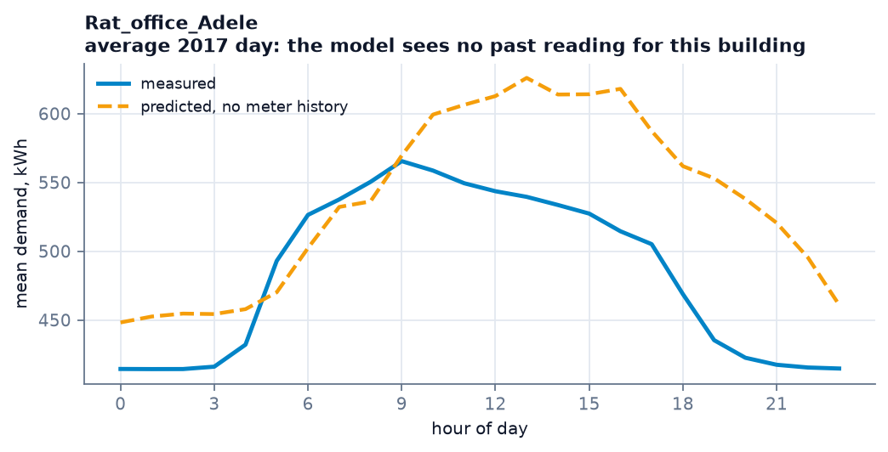
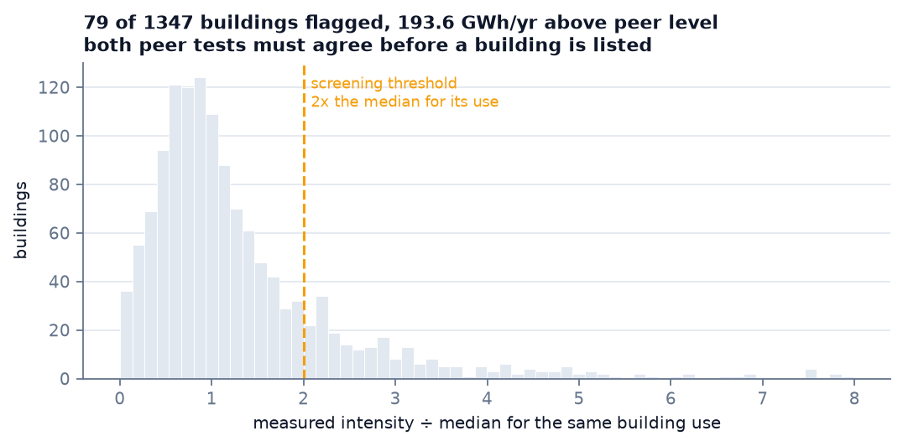
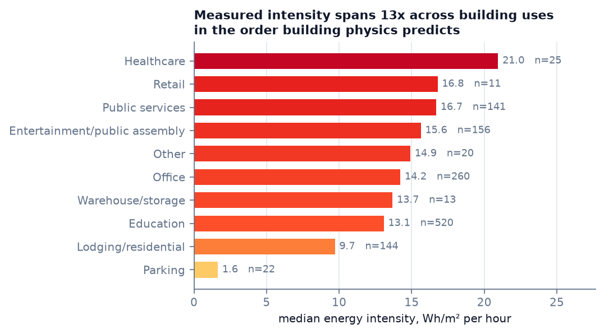

# Building Energy Intelligence

**[Open the dashboard →](https://dogadurak.github.io/Building-Energy-Intelligence/)**

*Which buildings to inspect first, what to check when you get there, and how much energy is at stake.*


A decision-support system for building energy, built on **23 million hourly
meter readings from 1,381 real buildings in 15 cities**. It forecasts
demand, finds buildings consuming far more than comparable ones, and says what
to inspect — with the limits of each answer stated rather than implied.


*Every figure here is generated from the result files by
`app/experiments/make_figures.py`, so none can drift from the numbers it claims
to show.*

---

## Headline numbers

| | |
|---|---|
| **Day-ahead forecast** | **16.0% CV(RMSE)** — inside ASHRAE Guideline 14's 30% hourly criterion (NMBE +1.2%, criterion ±10%) |
| **Cold start** — no meter history at all | 43.7% CV(RMSE) from attributes and weather alone |
| **Screening** | **79 of 1,347** buildings flagged, **194 GWh/year** above peer level |
| **Screening stability** | flags persist across independent years at **94.8%** (r = 0.988) |
| **Does urban context help?** | **No — and it is measured.** Location encoded perfectly is worth 2.8 CV(RMSE) points; building attributes 21.5. A **7.7×** difference, in 12 of 12 held-out cities |

Findings: **[docs/RESULTS.md](docs/RESULTS.md)** · What each choice rests on:
**[docs/METHOD.md](docs/METHOD.md)** · Data audit: **[docs/DATA_QUALITY.md](docs/DATA_QUALITY.md)**

<details>
<summary><b>Contents</b></summary>

- [The data](#the-data) — what BDG2 is, what is thrown away, what is missing
- [Reading the numbers](#reading-the-numbers) — what CV(RMSE) means here, and which protocol produced it
- [Past → Present → Future → Action](#past--present--future--action) — the four questions, one tab each
- [Where the model transfers, and where it does not](#where-the-model-transfers-and-where-it-does-not)
- [The research finding](#the-research-finding) — the negative result, and why it is a bound rather than a failure
- [How the modules fit together](#how-the-modules-fit-together)
- [Quick start](#quick-start) — dataset, stack, experiments, model
- [The published dashboard](#the-published-dashboard) — how a page with no server shows live predictions
- [The API](#the-api) — every endpoint, and which survive into the static build
- [The live path](#the-live-path) — meter reading in, scored insight out, over NGSI-LD
- [Method notes](#method-notes) — protocols, leakage guard, power, provenance
- [Layout](#layout) · [Tests](#tests) — and how to check these claims yourself
- [What this repository fixed about itself](#what-this-repository-fixed-about-itself)
- [Limitations](#limitations) · [Next](#next)

</details>

---

## The data

[Building Data Genome Project 2](https://github.com/buds-lab/building-data-genome-project-2)
(Miller et al. 2020, CC BY 4.0): two years of hourly meter readings from
non-residential buildings across North America and Europe, published with a
metadata row per building. This project uses the **electricity** meter, 2016 for
training and 2017 held out.

| | Published | After quality screening |
|---|---:|---:|
| Buildings | 1,636 | **1,381** |
| Sites | 19 | 18 |
| Independent cities (40 km blocks) | — | 15, of which **12** carry leave-one-city-out folds |
| Hourly rows | — | **22,936,238** |

**What gets excluded, and why.** 197 of 1,578 screened meter series are dropped
before any model sees them — 107 for long stuck or zero runs, 61 for missing too
much of the record, 23 for too few valid hours, 6 with no valid readings at all.
A meter that reports the same value for a week is not a building with steady
demand; it is a meter that stopped.

**How complete the attributes are.** This decides what a cold-start model can be
given, and half of it is missing:

| Column | Populated | Used as a feature |
|---|---:|:---:|
| `sqm` (floor area) | 100% | ✔ as `log_sqm` |
| `primaryspaceusage` | 98.7% | ✔ one-hot, 16 categories |
| `yearbuilt` | 49.9% | ✔ as age; **NaN where absent, never imputed** |
| `numberoffloors` | 27.0% | ✔ same |
| `occupants` | 14.1% | ✘ too sparse |

Absent values are passed to the model as missing rather than filled with a
median. XGBoost learns a direction for them; a filled-in value would be a
measurement the dataset does not contain, and the difference between "no
recorded year" and "built in the median year" is exactly what a portfolio
manager needs to see.

**Coordinates are site centroids, not buildings.** 15 of 19 sites carry
coordinates at all, and every building at a site shares one point. That single
property drives the research finding below and the 40 km discs on the map.

---

## Reading the numbers

Three conventions carry most of the weight, and a figure quoted without them is
not a result.

**CV(RMSE)** is root-mean-square error as a percentage of the mean observed
value — the metric ASHRAE Guideline 14 uses for whole-building M&V. It is
computed **per building and then aggregated across folds**, so a portfolio
figure is not dominated by whichever building happens to consume the most.
Guideline 14 accepts **30% for hourly data**; the day-ahead forecast sits at
16.0%, and the cold-start task does not meet it and is not claimed to.

**NMBE** is normalised mean bias error: whether the model is systematically high
or low, which CV(RMSE) cannot show because it squares the residual. Guideline 14
allows **±10% hourly**. A model can be imprecise and unbiased at the same time,
and the cold-start model is exactly that (−0.4% temporal) — useful for a
portfolio total, weak for a single building.

**The protocol is part of the number.** The same model measured four ways:

| Protocol | What is held out | Answers |
|---|---|---|
| `random` | random hours | an optimistic ceiling — adjacent hours of the same building fall on both sides of the split |
| `temporal` | 2017, trained on 2016 | how well it carries forward in time for a building it has seen |
| `leave_buildings_out` | whole buildings | a new building in a city already in training |
| `leave_block_out` | whole cities (40 km blocks) | a new city entirely — the case the model is sold for |

The gap between the first and the last is itself a finding: a random split makes
every model here look roughly **twice as good** as it is on an unseen city. That
is why all four are reported side by side rather than one being declared correct.

**One quantity, two aggregations.** Across the 12 held-out cities the
cold-start model's CV(RMSE) has a **median of 59.5%** and a **mean of 75.7%**.
The gap is one city: eleven score between **53.9% and 68.1%**, and `Lamb` — a
fold of very small consumers, where CV(RMSE) is unstable — scores **244.3%**.
Both figures appear in the product and they mean different things:

- the **results table** shows the median, because it describes the typical city;
- the **prediction band** and the **screening gate** use the mean, because a
  band has to cover the bad case and a wider gate flags fewer buildings.

The dashboard labels which is which. `app/model_metrics.py` is the single place
that resolves it, and `tests/test_model_metrics.py` holds it there.

---

## Past → Present → Future → Action

Four questions in sequence, one tab each.

### 1. How much does it consume?  ·  *Monitoring*

`explore_api.py` serves any building's real hourly series, aggregated three ways
— average day, weekday pattern, monthly shape — with the model's prediction
drawn over it.



The model is given **no past reading** for this building, so the two curves are a
genuine out-of-sample comparison rather than a fit replayed against its own
training data. It picks up the diurnal shape from building type, size and
weather — the 06:00 rise, the midday peak — and then misses what is specific to
this building: it over-predicts the afternoon and does not see the sharp 17:00
drop. That gap *is* the cold-start problem, drawn.

**What the module gives you:** measured mean, energy intensity, hours of data,
and this building's own CV(RMSE) and NMBE against the served model.

### 2. Is it abnormal?  ·  *Deviation scanning*

A baseline is fitted to the building's own 2016 from calendar and weather alone,
then applied to 2017 — the whole-building approach of **IPMVP Option C / ASHRAE
Guideline 14**. Deviations are grouped into events, because a fault is a run of
hours and a single hour is noise.

Two guards, both added after the first version produced nonsense:

- **A persistent level change** is reported as itself, not as a year-long
  "event". IPMVP calls this a non-routine adjustment: the building changed, it
  did not break.
- **If the baseline no longer describes the building**, no events are listed at
  all. Guideline 14 supplies the test — a baseline whose CV(RMSE) on the
  reporting year exceeds 30% is unfit for M&V — and the panel says the building
  needs re-baselining instead of inventing findings.

### 3. What will it consume?  ·  *Forecasting*

Accuracy is reported **as a curve, not a number** (figure at the top), because a
forecast figure without its horizon is not a result:

| Horizon | Temporal | Unseen building | NMBE | G14 |
|---|---:|---:|---:|:---:|
| 1 hour ahead | 9.26% | 9.52% | +0.56% | ✔ |
| **24 hours ahead** | **16.03%** | 16.21% | +1.18% | ✔ |
| 1 week ahead | 21.43% | 22.16% | +1.55% | ✔ |
| No history | 43.65% | 59.50%¹ | −0.43% | ✘ |

¹ unseen *city*, a stricter test than unseen building.

Lags are restricted to what is legally available at each horizon — using last
hour's reading to predict a week ahead would be leakage, and three tests assert
it cannot happen.

### 4. What should we do about it?  ·  *Screening and diagnosis*

A building reaches the shortlist only when **two independent peer tests agree**:
its intensity against the median for its use type, and its consumption against
what the model predicts for a building of that type, size and age. Requiring
both cuts the list from 249 to 79 — every name costs someone a site visit.



Most of the portfolio sits near its peer median; the tail is what an auditor
should see. The threshold is adjustable in the interface and the counts move
with it.

Then the diagnosis. Load *shape* is compared against the same peer group,
because shape says **when** the energy goes, which annual totals cannot:

| Metric | What a high value suggests |
|---|---|
| Overnight vs occupied hours | no out-of-hours switch-off — check BMS schedules |
| Weekend vs weekday | no weekend setback — check holiday calendars |
| Always-on share of peak | continuous loads: server rooms, pumps left in hand |
| Summer vs shoulder season | cooling-driven — chiller sequencing, setpoints |
| Winter vs shoulder season | direct electric heating — heat-pump retrofit case |

**Every finding carries what would refute it.** A high overnight load is as
consistent with a data centre or lab freezers as with a scheduling fault, and
the interface says so on every card. These are hypotheses for a site visit, not
conclusions about a building.

---

## Where the model transfers, and where it does not

Each bar is a city held **entirely out of training** — the model saw no building
from it. The dashboard shows the same result on a globe, with each city drawn as
a 40 km disc: the dataset's own positional uncertainty, to scale rather than
implied away.


The model is not equally trustworthy everywhere, and the system reports that:

| Primary use | CV(RMSE) | | Floor area | CV(RMSE) |
|---|---:|---|---|---:|
| Healthcare | 21.2% | | > 20,000 m² | 28.8% |
| Lodging/residential | 29.4% | | 5,000–20,000 m² | 32.8% |
| Education | 37.7% | | 1,000–5,000 m² | 41.2% |
| Office | 42.0% | | < 1,000 m² | 48.3% |
| Mixed use | 49.7% | | | |

A flag on a 40,000 m² hospital rests on a model performing at 21–29%; a flag on
an 800 m² mixed-use building rests on one at nearly 50%. The same flag does not
carry the same weight.

---

## The research finding

The urban-energy literature widely assumes that satellite and OSM context —
vegetation, urban heat, built-up density — improves building energy prediction.
This project tested it, and the interesting part is *how*.

**The usual test is impossible here.** BDG2 publishes coordinates *to city
level*. From Miller et al. (2020), *Scientific Data* 7:368:

> "In all cases, all buildings are within a 25-mile (40-kilometer) radius of the
> central location of the site or city."

That is 5,027 km² of uncertainty — 3.2× Greater London. A 250 m buffer, the
scale at which NDVI or land-surface temperature is sampled, is **1/25,600** of
it. A value extracted there describes an arbitrary point in a metropolitan
region, not a building.

**So the question was reframed into one the data can answer.** Site identity is
a *perfect* encoding of location: 12 blocks, no measurement error, no cloud
cover. Every site-level satellite variable is a lossy compression of it, so
measuring site identity bounds all of them at once.

| Added to a weather model | CV(RMSE) gain |
|---|---:|
| Perfect site identity | **2.8 points** |
| Building attributes (area, use, age) | **21.5 points** |



The reason is visible in the data: what a building is *for* spans a 13× range in
measured intensity, in the order building physics predicts — parking lowest,
healthcare highest. Location, across 12 cities, carries nothing comparable.


Building attributes are worth **7.7× more** than location encoded perfectly, in
**12 of 12** held-out cities (*p* < 0.001). No satellite layer computable on
this dataset could exceed 2.8 points. That is a negative result stated as a
measured bound, not a failure to find something.

A **third line of evidence** came from permutation importance on the served
model: shuffling `log_sqm` costs 180 CV(RMSE) points, every weather column under 2.

### Data-quality findings along the way

- **One published coordinate is wrong.** `Wolf` is recorded at latitude 53.3498,
  longitude **+6.2603**, timezone `Europe/Dublin`. Dublin is at **−6.2603** — the
  latitude is right and the magnitude matches exactly, so only the sign differs,
  and the published point falls in the North Sea. Sampling satellite imagery
  there would return water pixels. It is flagged and excluded from geographic
  use, **not silently corrected**.
- **Three "different" London sites are 1–2.5 km apart**, and two Ottawa sites
  3.8 km apart. Treating them as independent folds would leak: 15
  coordinate-bearing sites become **12 independent blocks**.
- **197 of 1,578 meter series** fail quality screening — stuck meters, outages,
  thin coverage.

---

## How the modules fit together

```
BDG2  ──►  build_dataset ──►  Parquet, partitioned by site
23 M rows                     22.9 M rows · 1381 buildings · 18 sites
                                    │
        ┌───────────────────────────┼───────────────────────────┐
        ▼                           ▼                           ▼
  evaluation/                 experiments/                app/*.py
  4 protocols                 M0–M3' ladder               screening
  ASHRAE G14                  horizon sweep               diagnostics
  bootstrap + power           production model            anomaly
        │                           │                           │
        └────────► results/ ◄───────┘                           │
                      │                                          │
                      ▼                                          ▼
              make_figures                                 main.py (API)
              docs/img/*.png                               dashboard
```

| Module | File | What it decides | Grounded in |
|---|---|---|---|
| **Dataset** | `data_engineering/build_dataset.py` | which buildings are modellable at all | quality screening, coordinate validation |
| **Leakage guard** | `data_engineering/leakage.py` | whether a feature set is secretly a building index | written from a real failure in this repo |
| **Cohorts** | `data_engineering/cohorts.py` | what counts as an independent city | BDG2's own 40 km positional bound |
| **Evaluation** | `evaluation/` | what a number is allowed to claim | ASHRAE Guideline 14, Wadoux et al. 2021 |
| **Ladder** | `experiments/ladder.py` | what each feature group is worth | M3′ identity control |
| **Screening** | `screening.py` | which buildings to inspect first | ENERGY STAR peer-group logic |
| **Diagnostics** | `diagnostics.py` | what to check on a given building | load-shape analysis against peers |
| **Anomaly** | `anomaly.py` | when a building stopped behaving normally | IPMVP Option C baseline |

Three properties hold across all of them, and they are the point of the project
rather than incidental:

**Nothing is generated for display.** Every number on the dashboard traces to a
file in `results/` or a live model call. When an experiment has not been run the
endpoint returns 404 with the command to run, rather than a plausible value.

**Every claim carries its own limit.** Predictions ship with the protocol that
produced their error band. Screening states that high consumption is not proof of
waste. Diagnoses list what would refute them. The anomaly scan refuses to list
events when its baseline no longer fits.

**A negative result is reported as a result.** The urban-context finding is the
central one, and it says the thing the project set out to add does not help.

---

## Quick start

```bash
# 0. Fetch the dataset — a plain clone does not include it
git submodule update --init --recursive
cd ai-service/data/building-data-genome-project-2
git lfs pull --include="data/metadata/*,data/weather/*,data/meters/cleaned/electricity_cleaned.csv"
cd ../../..

# 1. Start the stack. The PostGIS schema applies itself on first run.
docker compose up -d --build

# The FIWARE stack (Orion-LD + Mongo + MQTT) is optional and off by default:
#   FIWARE_ENABLED=true docker compose --profile fiware up -d

# 2. Build the dataset  (~23 M rows, partitioned by site)
docker exec -e PYTHONPATH=/app -w /app geotwin-ai-service \
  python -m app.data_engineering.build_dataset

# 3. Load building reference data into PostGIS
docker exec -e PYTHONPATH=/app -w /app geotwin-ai-service \
  python -m app.data_engineering.load_buildings_to_db

# 4. Run the experiments  (~1 h)
docker exec -e PYTHONPATH=/app -w /app geotwin-ai-service \
  python -m app.experiments.run_ladder --task cold_start --rows-per-building 800 --seeds 3
docker exec -e PYTHONPATH=/app -w /app geotwin-ai-service \
  python -m app.experiments.analyse_ladder --run results/ladder/cold_start

# 5. Train the served model
docker exec -e PYTHONPATH=/app -w /app geotwin-ai-service \
  python -m app.experiments.train_production --spec M3_building
```

Dashboard **http://localhost:5173** · API docs **http://localhost:8000/docs**

---

## The published dashboard

**[dogadurak.github.io/Building-Energy-Intelligence](https://dogadurak.github.io/Building-Energy-Intelligence/)**

The steps above are what it takes to run this project: a database, 276 MB of
parquet partitions, an hour of experiments. The published page needs none of
them, because GitHub Pages serves files and nothing else. That constraint is
worth stating plainly, since it decides what the page can honestly show.

**The figures are frozen, and the page says so.** `scripts/export_web_data.py`
runs the read-only endpoints in-process and writes their *exact response bytes*
to `frontend/public/data/`. Nothing is recomputed for display and no endpoint is
re-implemented, so a number on the page is a number the API returned. The footer
carries the date it was returned.

**The predictions are not frozen.** A frozen prediction would be a lookup table
with a slider on it. Instead the page carries the model — the 400 trees of the
served XGBoost ensemble, exported by `scripts/export_model_json.py` — and
evaluates them in the browser. Move the temperature slider and the model runs.

That claim is the kind that is easy to make and easy to get wrong, so it is
tested rather than asserted. Each export writes a fixture of what the Python
model actually answered: 150 end-to-end cases (a real building, a timestamp, a
temperature) and 200 design rows chosen to land on the missing-value branches.
`frontend/src/model/predictor.test.js` replays every one through the browser
evaluator, and CI refuses to publish a build where they disagree.

What the published page therefore does **not** have: `POST /api/detect-anomalies`
and the FIWARE insight publishing behind it, which need a live service. The
dashboard does not call them; running the stack locally does.

To regenerate the published data after the analysis changes, from `ai-service/`:

```bash
python -m scripts.export_web_data     # frozen API responses -> frontend/public/data/
python -m scripts.export_model_json   # trees + parity fixture -> frontend/public/model/
```

Both read the parquet partitions and `results/`, neither of which is in git, so
CI cannot run them. Commit what they write. The deploy workflow checks the files
are present and the parity fixture still holds before it publishes.

---

## The API

```bash
curl -X POST localhost:8000/api/predict -H 'Content-Type: application/json' -d '{
  "building_id":"Rat_office_Adele","timestamp":"2017-07-15T15:00:00",
  "airTemperature":31.0,"dewTemperature":21.0}'
```
```json
{"expected_energy_kwh": 490.17,
 "expected_band_1cvrmse": {"lo": 119.36, "hi": 860.98},
 "band_basis": {"cv_rmse_pct": 75.65, "protocol": "leave_block_out",
                "aggregation": "mean_over_folds", "n_folds": 12}}
```

The band is the model's **demonstrated out-of-sample error**, and the response
names the protocol that produced it, over how many folds, and which aggregation
— not a percentile of its own training residuals. Anomalies are flagged as
multiples of that band.

The **static** column says whether the endpoint survives into the published
GitHub Pages build, where there is no server. Read endpoints are frozen to files
by `scripts/export_web_data.py`; `predict` and `simulate-what-if` are answered by
the model running in the page; the rest need a live service.

### Serving

| Endpoint | Answers | Static |
|---|---|:---:|
| `GET /api/health` | which model is loaded, its held-out accuracy, the protocol and aggregation behind it | ✔ |
| `GET /api/buildings` | the BDG2 portfolio: id, site, use, area, year, quality flag | ✔ |
| `POST /api/predict` | expected demand for a building with no meter history, with an evidence-based band | ✔ in-page |
| `POST /api/simulate-what-if` | how predicted load moves with temperature — weather sensitivity only | ✔ in-page |
| `POST /api/detect-anomalies` | is this reading outside the model's demonstrated error? | ✘ |
| `POST /notify` | NGSI-LD subscription sink; publishes insights back to the context broker | ✘ |

### Findings

| Endpoint | Answers | Static |
|---|---|:---:|
| `GET /api/results/tasks` | which experiments have actually been run | ✔ |
| `GET /api/results/{task}/summary` | CV(RMSE) by protocol and model — the ladder table | ✔ |
| `GET /api/results/{task}/by-city` | per-city transfer accuracy, joined to real site coordinates | ✔ ¹ |
| `GET /api/results/{task}/contrasts` | paired contrasts with intervals and the power behind them | ✔ |

### Evidence behind a claim

| Endpoint | Answers | Static |
|---|---|:---:|
| `GET /api/explore/building/{id}/profile` | this building's measured 2017 load, with the prediction over it | ✔ ² |
| `GET /api/explore/site/{id}/summary` | what a site's portfolio contains: use mix, sizes, measured EUI | ✔ ² |
| `GET /api/explore/eui-by-use` | measured intensity by building use, across every site | ✔ |
| `GET /api/screening` | ranked shortlist of buildings to investigate | ✔ ³ |
| `GET /api/diagnose/{id}` | what to check on this building, and what would refute it | ✔ ² |
| `GET /api/anomaly/{id}` | when did this building stop resembling its own past? | ✔ ² |
| `GET /api/spatial-context/{id}` | multi-scale spatial features — **unpopulated, Sprint 2** | ✘ |

¹ `cold_start` only. A forecast horizon holds out *time*, not cities, so there is
no transfer map to draw and the endpoint says so with a 404.
² exported for the 352 buildings the interface can reach — the 300 the panel
lists plus the 63 that any screening threshold flags — and the 15 sites those
buildings belong to. The remaining buildings are not reachable by any click.
³ one file per stop of the panel's slider (1.5 to 4.0).

`spatial-context` is empty on purpose, and that is the research finding rather
than an unfinished feature. BDG2 publishes 15 distinct coordinates for 1,636
buildings, each covering a 40 km radius; an NDVI or land-surface-temperature
value sampled there would be the same number for every building at a site, which
is a site identifier wearing a geoscience label. Populating the table would mean
re-committing the defect documented in
[`archive/legacy_v3/`](archive/legacy_v3/README.md). The table, the endpoint and
[`docs/QGIS_VALIDATION_WORKFLOW.md`](docs/QGIS_VALIDATION_WORKFLOW.md) are the
acceptance checklist for a dataset that carries per-building coordinates — see
[Next](#next). Until then the endpoint answers 404 and
`tests/test_anomalies.py` asserts it stays empty.

Unknown building → `404`. No model → `503`. No experiment run → `404` **with the
command to run it**. Failures are failures, not `200` with an error string in the
body — an earlier version returned exactly that, and a caller checking status
codes read a failure as a successful prediction.

---

## The live path

Everything above is request/response: you ask, the service answers. It also runs
as a stream, and the difference matters for what the system is *for* — nobody
watches a dashboard waiting for a building to misbehave.

```
replay_service ──► Orion-LD ──► subscription ──► POST /notify
  measured hours     context       on `energy`        │
  from BDG2          broker                           ▼
                        ▲                     score against the
                        │                     model's validated band
                        └────── AIInsight ◄───────────┘
```

A meter update lands in an NGSI-LD context broker; the broker notifies the
service; the service predicts what that building should have drawn at that hour
and, if the reading sits more than twice the model's demonstrated error away,
writes an `AIInsight` back to the broker. Anything else subscribed — a work-order
system, an operator display — sees it without polling this service.

The insight carries the evidence, not a colour:

```json
{"id": "urn:ngsi-ld:AIInsight:INSIGHT_D66F85A3",
 "refRoom": "urn:ngsi-ld:Building:Bear_education_Yvette",
 "severity": "HIGH", "anomalyScore": 13.7,
 "observedValue": 81.25, "expectedValue": 7.16,
 "possibleCause": "Over-consumption. Observed 81.2 kWh against an expected 7.2 kWh:
                   13.7x the model's validated 75.7% CV(RMSE) band (leave_block_out)."}
```

```bash
docker compose --profile fiware up -d mongo orion-ld
docker exec -e PYTHONPATH=/app -w /app geotwin-ai-service python -m app.setup_subscription
docker exec -e PYTHONPATH=/app -w /app geotwin-ai-service \
  python -m replay.replay_service --site Bear --speed 4
```

**The replay sends measured values and nothing else.** An earlier version
multiplied every fiftieth reading by 2.5 "for demo purposes", which is showing a
detector only the spikes that were planted for it. The same practice is listed
among the defects this repository removed from its anomaly experiments; leaving
it in the demo path would have made that claim false.

**Why this needed three files to agree.** The subscription watched
`temperature`, `humidity` and `hvac_status` — attributes nothing here publishes
— and asked the broker to forward those three, while the handler reads `energy`
and the weather columns. No notification could fire, and one that somehow did
would have arrived carrying nothing the handler uses. The loop had never run,
and nothing looked wrong: a subscription that never fires is indistinguishable
from a quiet week. `tests/test_fiware.py` now holds the publisher, the
subscription and the handler to one list of attributes, without needing a broker.

---

## Method notes

**Four validation protocols, reported side by side** — random, temporal,
unseen-building and unseen-city. The gap between them is a result: a random
split makes every model look roughly **twice as good** as it is on an unseen
city. Following Wadoux et al. (2021), validation is matched to the prediction
domain being claimed rather than declaring one protocol correct.

**A leakage guard, written from a real failure.** An earlier version of this
project fed the model hand-authored NDVI and elevation constants — one value per
building, which is a building index wearing a geoscience label — plus raw
latitude and longitude. `leakage.py` now refuses feature sets that identify
buildings and reports what fraction a set pins down uniquely; run against that
archived feature set it returns **1.0**. The episode is documented in
[`archive/legacy_v3/`](archive/legacy_v3/README.md) rather than deleted.

**Honest power reporting.** With 12 spatial blocks the minimum detectable effect
is ~24 CV(RMSE) points. Where a contrast falls below that, the report says so
instead of claiming a null result.

**Provenance, including where it is still missing.** Each result file records
the cohort, the seeds, the row sampling and the commit that produced it.
`provenance.py` exists because that last field used to read `"unknown"` on every
run: the container has no `git` binary, the `subprocess` call failed, and the
failure was swallowed. It now reads `.git` directly — HEAD, refs and
`packed-refs` — and reports *where* the answer came from.

It is not retrospective. The two runs made before that fix still carry
`git_sha: "unknown"`, and one of them is `cold_start`, which produces the
headline cold-start figure and the urban-context finding:

| Run | `git_sha` |
|---|---|
| `cold_start` | `unknown` — predates `provenance.py` |
| `forecast` | `unknown` — predates `provenance.py` |
| `forecast_h24` | `beb32a2…` |
| `forecast_h168` | `90fc8af…` |

Re-running the ladder would fill them in and would not change a number. Until
that happens the honest statement is that the headline results are reproducible
from the committed code and data but are not *pinned* to a commit, and this
table is here rather than a claim that they are.

**The published page cannot drift from the analysis silently.**
`scripts/verify_web_data.py` re-requests every frozen response and compares it
byte for byte with the live API, recomputes the CV(RMSE) matrix from
`results/ladder/*/fold_results.csv` in a second implementation — deliberately
not by calling the endpoint it is checking — and matches the numbers asserted in
this README against both. On the export published here, **1,091 of 1,091 frozen
responses were byte-identical to the live API**, and every headline figure above
traced back to the fold results.

It also reports what it knows is imperfect rather than passing over it: the
legacy `cv_rmse_median_pct` naming above appears in a *known, not a failure*
section, with the reason it cannot be rewritten without a retrain.

---

## Layout

```
ai-service/app/
  data_engineering/   dataset build, quality screening, coordinate validation,
                      cohorts with 40 km spatial blocking, leakage guard
  evaluation/         ASHRAE G14 metrics, protocols, bootstrap and power, harness
  experiments/        the M0–M3' ladder, analysis, production training
  screening.py        peer-based triage and its year-over-year validation
  diagnostics.py      load-shape comparison against peers
  anomaly.py          IPMVP Option C baseline deviation scanning
  main.py             serving API
  db.py               one place the database is reached from
  fiware_client.py    publish a scored deviation to the context broker
  setup_subscription.py  register the subscription that drives the live loop
  jsonsafe.py         absent values reach the client as null, not as NaN
  model_metrics.py    which error figure is quoted, and what it averages over
db/                   the schema, applied in order on first start
docs/                 RESULTS.md, METHOD.md, DATA_QUALITY.md
archive/legacy_v3/    quarantined earlier work, with its defects documented
frontend/src/         Cesium globe, ladder table, screening, diagnostics
frontend/src/model/   the served ensemble, evaluated in the browser, and the
                      parity fixture that holds it to the Python one
ai-service/replay/    stream measured BDG2 hours into the broker
ai-service/scripts/   freeze the API and the model for the published page,
                      and verify the frozen copy still matches the analysis
.github/workflows/    tests.yml runs the Python suite on every push;
                      deploy-web.yml checks the page against the analysis,
                      then publishes it
```

## Tests

```bash
docker exec -e PYTHONPATH=/app -w /app geotwin-ai-service pytest tests/ -q   # 116
cd frontend && npm test                                                     # 37
```

CI runs both. `tests.yml` executes the 111 Python cases that need no database on
every push; `deploy-web.yml` runs the 37 frontend cases before it is allowed to
publish. The remaining five open a PostGIS connection and run under
docker-compose.

Of the 116 Python cases, 111 need neither a database nor the dataset — they are
built from synthetic frames, and they include regressions for the coordinate
sign error, identity leakage, forecast-horizon leakage, the year-long-event
bug, the NaN encoding that made two endpoints answer 500
(`tests/test_jsonsafe.py`), the metric that was published as a median while
holding a mean (`tests/test_model_metrics.py`), the environment-variable
mismatch that made one endpoint report a config error as a database fault
(`tests/test_db.py`), and the three-way contract that left the live streaming
loop unable to fire (`tests/test_fiware.py`).

The 37 frontend cases cover the two things the published page cannot be taken
on trust for: that the browser's copy of the model answers what this
repository's Python model answers (`src/model/predictor.test.js`), and that the
values on screen are the values in the exported files
(`src/App.data.test.jsx`) — checked by rendering the real components against
the real export. `src/App.layout.test.jsx` pins the layout at phone widths,
where the panel used to leave the map zero pixels wide.

Then there is the chain the tests cannot reach, because it needs the 276 MB of
parquet that is not in git:

```bash
cd ai-service && python -m scripts.verify_web_data
```

That re-requests every frozen response and compares it byte for byte with the
live API, recomputes the headline CV(RMSE) matrix straight from
`results/ladder/*/fold_results.csv` and checks the summary endpoint against it,
and matches the numbers asserted in this README against both. Run it after
re-exporting, before committing.

---

---

## What this repository fixed about itself

An earlier version of this project reported R² = 0.9954 on four buildings and
presented Sentinel-2 NDVI, OSM density and Copernicus DEM as inputs. None of
those features existed: they were hand-authored Python constants and a
`random.uniform()` mock, and the R² was the model learning which of four
buildings it was looking at. Rebuilding it turned up a series of defects worth
listing, because the classes they fall into recur in this kind of work.

**Fabricated inputs presented as measurements**

- NDVI, NDBI, building density, elevation and slope written as literals for four
  buildings, with comments like `# High vegetation (pine forest)`.
- `dem_ingestion.py` printing *"Mocking DEM extraction (via OpenTopography /
  Copernicus API simulation)"* and returning `45.2 + random.uniform(-1, 1)`.
- 147 rows of `sentinel_observations` with plausible product ids, midnight
  acquisition times on a regular 5-day grid, and **every measurement column
  NULL** — provenance without data. The script that wrote them was not in the
  repository.
- Buildings at the BDG2 `Rat` site (Washington DC) assigned invented İzmir
  coordinates — the wrong continent.

**Results that measured the wrong thing**

- The reported "spatial improvement" was building identity: with four buildings,
  each of those eight variables is a bijective re-encoding of `building_id`, and
  `lat`/`lon` were fed to the model directly. Predicting each building's constant
  mean — no model at all — scored R² = 0.9188 on the same split.
- Two `ablation_results.json` files disagreed by 20×, one written by a script
  version that no longer existed.
- The anomaly experiment set `contamination = n_anomalies / len(test_df)`,
  telling the detector how many anomalies to find, fitted it on the test set,
  and injected anomalies only where a feature it was given could reveal them.

**Infrastructure that had never worked**

- `.gitignore` was UTF-16LE with a BOM, so git could not parse any pattern in
  it. 1,302 files of `node_modules` were tracked. Tracked files: 1,460 → 155.
- The Docker image had never built correctly — `tenacity` and `pyarrow` were
  missing from it, and the running container only worked because packages had
  been installed into it by hand. A fresh `docker compose up` crash-looped.
- Compose mounted a single SQL file into `/docker-entrypoint-initdb.d`, so four
  schema files never ran. `building_energy_history` did not exist on a fresh
  volume, which broke every request the API served. 5 tables → 16.
- Every result recorded `git_sha: "unknown"`: the image has no git binary, the
  subprocess call failed, and the failure was swallowed.
- Both GIS endpoints returned HTTP 500 — the repository selected `building` and
  `highway` where the schema defines `building_type` and `highway_type` — so the
  only real spatial data in the system, 2,465 OSM buildings, was unreachable.

**Defects introduced during the rebuild, and caught**

- The screening rule's model test read a global populated only by the FastAPI
  startup hook, so in a CLI process half the design silently did not run. Fixing
  it cut the flagged list from 249 buildings to 79.
- The first anomaly scan returned a single "event" 1,343 hours long, because the
  building's consumption level had moved between the baseline and reporting
  years. IPMVP calls that a non-routine adjustment; the building had changed,
  not broken.
- The forecast headline quoted 9.3% CV(RMSE) with no horizon attached. With
  `energy_lag_1` available that is close to nowcasting, and persistence alone
  explains a median 88% of hourly variance.
- The `fig-cities` chart drew one fold at 1007% to scale, flattening the other
  eleven bars and painting its "improved" bar over the baseline so the worst
  fold looked like the best.

The last group matters most. The first three groups were inherited; the fourth
was mine, and the difference between a project that finds those and one that
ships them is the evaluation harness rather than any individual's care.

## Limitations

- **n = 12** for every city-level conclusion. BDG2 publishes 15 coordinates for 1,636 buildings.
- **Electricity only.** Chilled water and steam are unpulled LFS pointers, so cooling load — where a thermal-context hypothesis is most plausible — is untested.
- **CV(RMSE) is unstable for very small consumers.** See the `Lamb` fold in [docs/RESULTS.md](docs/RESULTS.md). It is also why the fold mean and median differ by 16 points; both are reported, and [Reading the numbers](#reading-the-numbers) says which is used where.
- **The band and the screening gate use the fold mean.** That is a choice, not a derivation: it is the conservative figure and it flags fewer buildings. Moving to the median would loosen the gate and lengthen the shortlist beyond 79.
- **Screening has no ground truth.** It is validated for stability across years, not against audit outcomes. High consumption is not proof of waste. The 94.8% persistence figure is measured on the peer-ratio test alone, not on the two-test rule that produces the 79.
- **Two result files are not pinned to a commit.** See [Method notes](#method-notes).
- **The dashboard is a showcase, not an operations tool.** No authentication, no multi-tenancy, no write path. The published build is a frozen snapshot with the model running client-side.
- **One dataset.** These results are about BDG2, not urban building energy modelling in general.

## Next

Per-building coordinates are the precondition for any real spatial claim. City
benchmarking disclosures have them: NYC Local Law 84 joins to PLUTO on BBL, and
Seattle and Chicago publish the same shape at a size that is easier to get right
first. That gives true geometry, floor count, year, use and measured energy for
thousands of buildings — where a 250 m buffer means something.

Two things that ought to be said before anyone reads this as a small step.

**It is a different measurement problem, not this one with better coordinates.**
Those disclosures report *annual* energy per building. Everything here is
hourly: CV(RMSE) under ASHRAE Guideline 14, load shapes, the diurnal profile the
diagnostics compare, the hour-by-hour anomaly scan. None of that survives the
change of target. The cohort logic, the leakage guard and the protocol
discipline carry over; the metrics and the harness around them do not.

**The first version of it needs no satellite imagery at all.** PLUTO carries the
geometry, so neighbourhood density, lot coverage, built-floor ratio and distance
to open space can be computed from the parcels themselves — real spatial
variables at real per-building positions, with no cloud masking and no
resampling. If the hypothesis fails against those, an NDVI pipeline is unlikely
to rescue it; if it holds, that is the point at which imagery earns its cost.

Either way it belongs in its own study rather than bolted onto this one. This
repository answers a question it could answer honestly and states the bound it
could not cross. That is a complete result, and a second study that measures
what this one could only bound would complete it rather than correct it.

---

**Licence** · Code: [MIT](LICENSE). The dataset is not covered by it and keeps
its own terms.

**Data** · Meter readings, weather and building metadata:
[Building Data Genome Project 2](https://github.com/buds-lab/building-data-genome-project-2)
(Miller et al. 2020, *Scientific Data* 7:368, CC BY 4.0). The weather columns the
model uses are BDG2's own, joined per site — nothing is fetched at serve time.
Basemap tiles in the dashboard: © OpenStreetMap contributors (ODbL).
