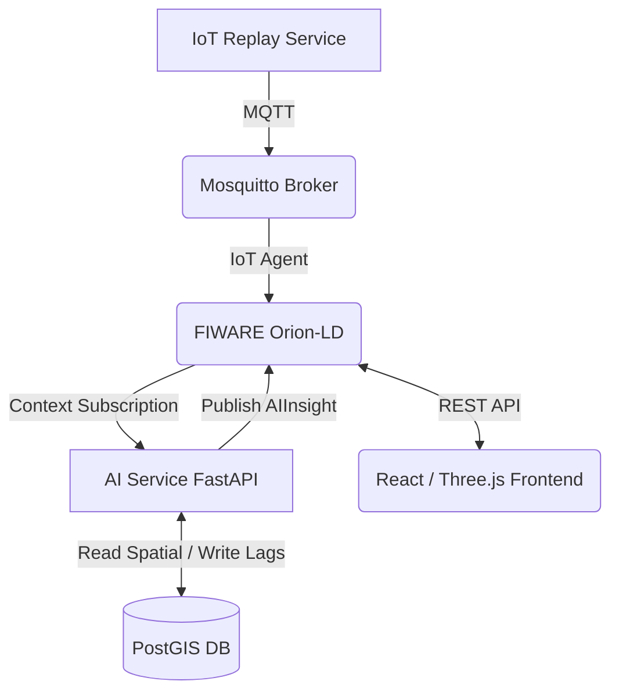

# 🏙️ Urban Digital Twin - AI-Powered Smart Facility


**Urban Digital Twin** is an advanced, real-time 3D simulation and facility management dashboard. It bridges the gap between physical infrastructure and digital monitoring by integrating **FIWARE Context Broker**, **PostGIS Spatial Database**, and a powerful **XGBoost AI Engine** to provide proactive, spatial-aware energy management.

---

## ✨ Key Features (V3 Updates)

### 🤖 AI-Powered Spatial Anomaly Detection (XGBoost V3)
- **Context-Aware AI:** The prediction engine evaluates 17 real-time and spatial features (including historical 24/168-hour lags, Building Density, NDVI, NDBI, Elevation, and Road Density).
- **Dual-Layer Detection:** Uses XGBoost for energy prediction and Isolation Forest to detect complex multidimensional anomalies.
- **Explainable AI (XAI):** Anomalies aren't just detected; the system explains *why* they happened (e.g., "Urban heat island effect exacerbated by low greenery").

### 🔮 What-If Scenario Simulation
- **Interactive AI Panel:** Tweak external parameters like Outdoor Temperature, Greenery Ratio (NDVI), and Building Density via the dashboard.
- **Real-time Projections:** The AI service instantly calculates the expected power load delta versus the baseline, empowering urban planners and facility managers to test climate and architectural interventions.

### 🛡️ Enterprise-Grade Resilience & Testing
- **Self-Healing Connections:** Powered by `tenacity`, all interactions between the AI service, PostGIS database, and FIWARE Orion-LD utilize **Exponential Backoff** to survive network blips and microservice restarts without dropping data.
- **Robust Testing Infrastructure:**
  - **Backend:** Covered by `pytest` and `pytest-asyncio` for fully automated API endpoint validation.
  - **Frontend:** Component tests using `vitest` and `@testing-library/react` ensure UI stability.

### 🗺️ GIS & Persistent Time-Series
- **PostGIS Integration:** Spatial features (elevation, slope, vegetation indices) are persistently stored and queried per building.
- **Dynamic Time-Series:** `building_energy_history` tables maintain rolling histories for dynamic lag feature calculation without relying on fragile in-memory buffers.

---

## 🏗️ System Architecture (Microservices)

The project leverages a containerized, event-driven microservices architecture via Docker Compose.



### 🗂️ Core Services
- **`geotwin-frontend`**: React, Vite, TailwindCSS, React Three Fiber. Runs on port `5173`.
- **`geotwin-ai-service`**: Python, FastAPI, XGBoost, Scikit-learn, Tenacity. Runs on port `8000`.
- **`geotwin-orion-ld`**: FIWARE Context Broker for managing NGSI-LD entities. Runs on port `1026`.
- **`geotwin-postgis`**: PostgreSQL + PostGIS extension for spatial and historical data. Runs on port `5432`.
- **`geotwin-mosquitto`**: MQTT broker for IoT telemetry ingestion.

---

## 🚀 Getting Started

### Prerequisites
- [Docker](https://www.docker.com/) and Docker Compose v2+

### 0. Fetch the dataset
The BDG2 dataset is a git submodule and is **not** included in a plain clone:
```bash
git submodule update --init --recursive
cd ai-service/data/building-data-genome-project-2
git lfs pull --include="data/metadata/*,data/weather/*,data/meters/cleaned/electricity_cleaned.csv"
```

### 1. Bootstrapping the Environment
Simply start the entire microservices cluster from the root directory:
```bash
docker-compose up -d --build
```
*Wait ~30 seconds for the databases and FIWARE to fully initialize.*

The PostGIS schema is applied automatically on first start: `./db` is mounted
into `/docker-entrypoint-initdb.d`, and Postgres runs every `*.sql` there in
lexical order (`01_init` → `06_spatial_context`). No manual `psql` step is
needed. To re-apply from scratch, drop the volume: `docker compose down -v`.

### 2. Initialize FIWARE Subscriptions
```bash
# Create FIWARE NGSI-LD Subscriptions for the AI service
docker exec -it geotwin-ai-service python app/setup_subscription.py
```

### 3. Start the Live Simulation (Replay Service)
To simulate live sensor data flowing into the digital twin (with injected synthetic anomalies):
```bash
docker exec -it geotwin-ai-service python app/scripts/replay_service.py
```

### 4. Access the Dashboard
Open your browser and navigate to:
**`http://localhost:5173`**

---

## 🧪 Running Automated Tests

**Backend (Pytest):**
```bash
docker exec -e PYTHONPATH=/app geotwin-ai-service pytest tests/
```

**Frontend (Vitest):**
```bash
docker exec geotwin-frontend npx vitest run
```

---

*Built with passion for the future of Smart Facilities and PropTech.* 🚀
