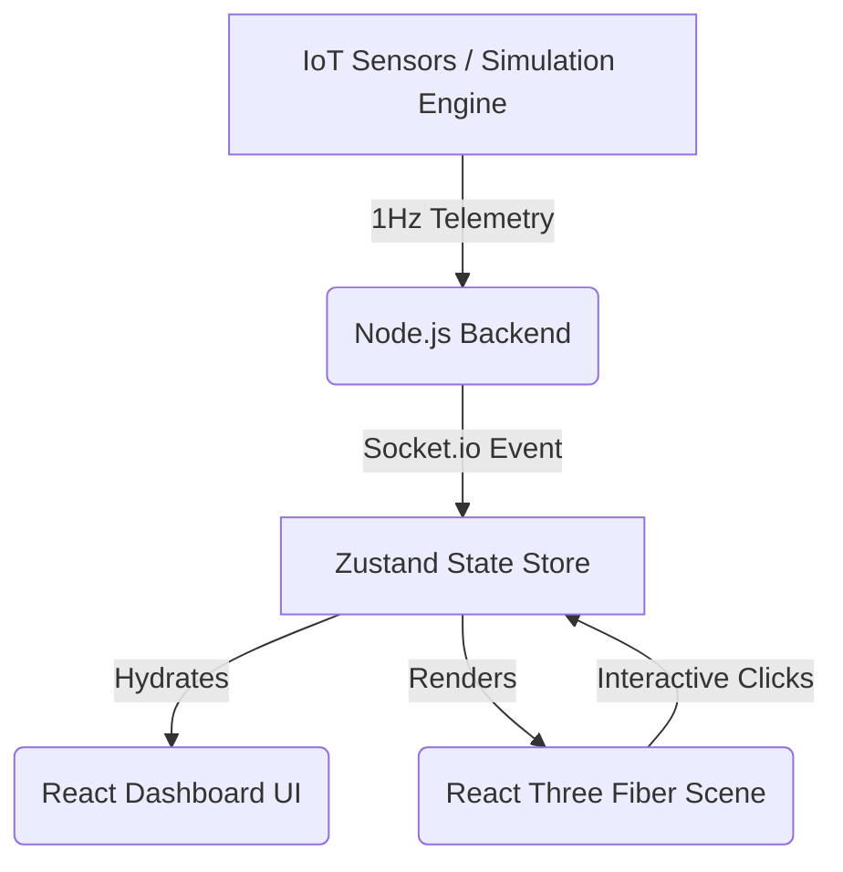

# 🏙️ Urban Digital Twin - Smart Facility Prototype


**Urban Digital Twin** is an advanced, real-time 3D simulation and facility management dashboard built with React Three Fiber, Node.js, and Socket.io. It bridges the gap between physical infrastructure and digital monitoring by bringing a full building telemetry system to life in the browser.

---

> 📸 **Screenshot Placeholder**
> *(Proje ekran görüntülerinizi `docs/` klasörüne ekleyip buradaki linkleri güncelleyebilirsiniz)*
> 
>  
> 
> 

---

## ✨ Key Features (Next-Level)

### 🕰️ Time-Travel & Historical Playback
- **Live Memory Buffer:** Telemetry data is buffered in real-time.
- **Rewind the Simulation:** Drag the timeline scrubber to view historical events. The entire 3D scene (lighting, elevators, people, HVAC status) and all analytical charts instantly revert to that exact second.

### 🏃‍♂️ AI Occupancy & Evacuation Simulation
- **Wandering Agents:** Procedurally generated occupants wander the floors during `NORMAL` operations.
- **Pathfinding Engine:** In the event of a `FIRE_EMERGENCY`, all wandering ceases and occupants calculate the fastest path to the central core shaft for evacuation.

### 🌤️ Dynamic Environment (Day/Night Cycle)
- A 24-hour virtual clock drives the global `EnvironmentLighting`.
- Realistic transitions from midnight-blue to sunrise-orange to noon-cyan.
- Neon building lights automatically activate during the night cycle.

### 🩻 MEP X-Ray & Roof Chiller Systems
- Inspect the physical plumbing and HVAC distribution without the facade.
- Animated glowing pipes flow down the core shaft from the detailed roof Chiller unit directly into individual floor zones.

### 🤖 AI-Powered Insights & "What-If" Analysis
- The backend engine constantly analyzes power load, temperatures, and security breaches to emit contextual AI alerts.
- **Scenario Injection:** Simulate HVAC failures or Security breaches and watch the digital twin react in real-time.

---

## 🏗️ System Architecture

The project is split into a robust **Node.js/Socket.io Backend** and a high-performance **React/Three.js Frontend**.



### 🗂️ Project Structure
```text
UrbanDigitalTwin/
├── backend/                  # Node.js Simulation Engine
│   ├── src/engine/           # Core AI & Simulation Logic
│   └── server.js             # Socket.io Entrypoint
├── frontend/                 # React UI + WebGL
│   ├── src/components/       # 3D Scene & UI Panels
│   ├── src/store/            # Zustand State Management
│   └── src/App.jsx           # Main Application Wrapper
└── README.md
```

---

## 🚀 Getting Started

### Prerequisites
- [Node.js](https://nodejs.org/) (v16+ recommended)
- `npm` or `yarn`

### 1. Start the Backend Simulation Server
```bash
cd backend
npm install
npm start
```
*The backend will boot up on `http://localhost:3001` and immediately begin simulating building data at 1Hz.*

### 2. Start the Frontend Application
Open a new terminal window:
```bash
cd frontend
npm install
npm run dev
```
*Vite will launch the development server, usually on `http://localhost:5173`. Open this URL in your browser.*

---

## 🎮 How to Use

1. **Camera Controls:** Left-click and drag to rotate the building. Scroll to zoom. Right-click and drag to pan.
2. **Floor Selection:** Click on any floor in the 3D view to isolate it. A detailed modal will appear with zone-specific metrics. Click outside the floor or the "X" button to reset the view.
3. **View Modes:** Use the left Control Panel to switch between Normal, Energy (Heatmap), HVAC (X-Ray), Security, and Fire modes.
4. **Time Travel:** Grab the slider at the bottom of the screen to drag the digital twin back into the past. Click **GO LIVE** to return to real-time sync.

---

*Built with passion for the future of Smart Facilities and PropTech.* 🚀
