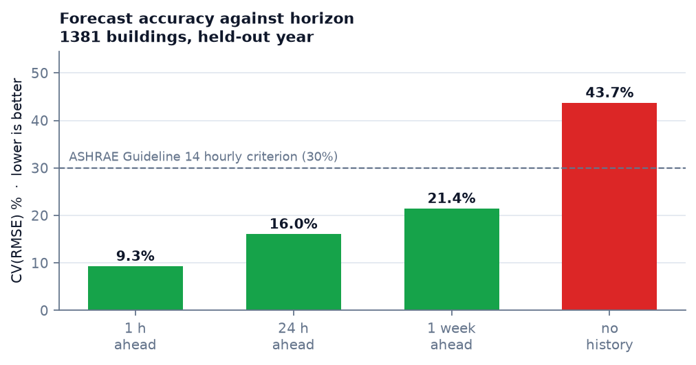
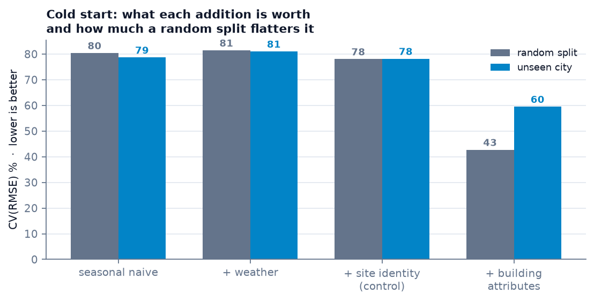
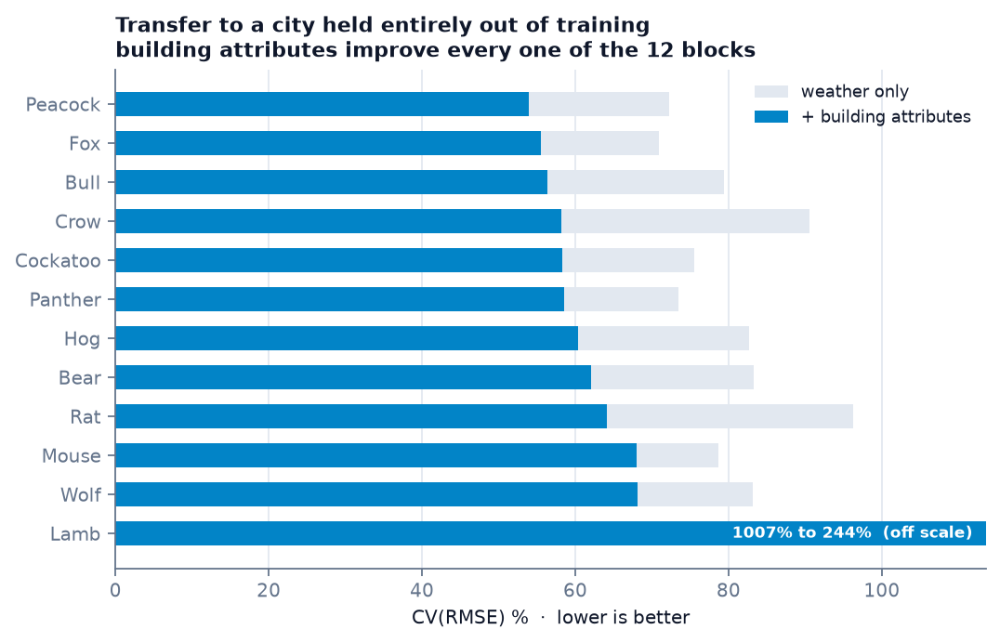

# Building Energy Intelligence

*Which buildings to inspect first, what to check when you get there, and how much energy is at stake.*


A decision-support system for building energy, built on **23 million hourly
meter readings from 1,381 real buildings across 12 cities**. It forecasts
demand, finds buildings consuming far more than comparable ones, and says what
to inspect — with the limits of each answer stated rather than implied.



*Every figure here is generated from the result files by
`app/experiments/make_figures.py`, so none can drift from the numbers it claims
to show.*

---

## Headline numbers

| | |
|---|---|
| **Day-ahead forecast** | **16.0% CV(RMSE)** — inside ASHRAE Guideline 14's 30% hourly criterion (NMBE +1.2%, criterion ±10%) |
| **Cold start** — no meter history at all | 43.7% CV(RMSE) from attributes and weather alone |
| **Screening** | **79 of 1,347** buildings flagged, **194 GWh/year** above peer level |
| **Screening stability** | flags persist across independent years at **94.8%** (r = 0.988) |
| **Does urban context help?** | **No — and it is measured.** Location encoded perfectly is worth 2.8 CV(RMSE) points; building attributes 21.5. A **7.7×** difference, in 12 of 12 held-out cities |

Findings: **[docs/RESULTS.md](docs/RESULTS.md)** · What each choice rests on:
**[docs/METHOD.md](docs/METHOD.md)** · Data audit: **[docs/DATA_QUALITY.md](docs/DATA_QUALITY.md)**

---

## Past → Present → Future → Action

Four questions in sequence, one tab each.

### 1. How much does it consume?

Measured load for any building — average day, weekday pattern, seasonal shape —
with the model's prediction drawn over it. The model is given **no past reading**
for that building, so the two curves are a genuine out-of-sample comparison
rather than a fit replayed against its own training data.

### 2. Is it abnormal?

A baseline is fitted to the building's own 2016 from calendar and weather alone,
then applied to 2017 — the whole-building approach of **IPMVP Option C / ASHRAE
Guideline 14**. Deviations are grouped into events, because a fault is a run of
hours and a single hour is noise.

Two guards, both added after the first version produced nonsense:

- **A persistent level change** is reported as itself, not as a year-long
  "event". IPMVP calls this a non-routine adjustment: the building changed, it
  did not break.
- **If the baseline no longer describes the building**, no events are listed at
  all. Guideline 14 supplies the test — a baseline whose CV(RMSE) on the
  reporting year exceeds 30% is unfit for M&V — and the panel says the building
  needs re-baselining instead of inventing findings.

### 3. What will it consume?

Accuracy is reported **as a curve, not a number** (figure at the top), because a
forecast figure without its horizon is not a result:

| Horizon | Temporal | Unseen building | NMBE | G14 |
|---|---:|---:|---:|:---:|
| 1 hour ahead | 9.26% | 9.52% | +0.56% | ✔ |
| **24 hours ahead** | **16.03%** | 16.21% | +1.18% | ✔ |
| 1 week ahead | 21.43% | 22.16% | +1.55% | ✔ |
| No history | 43.65% | 59.50%¹ | −0.43% | ✘ |

¹ unseen *city*, a stricter test than unseen building.

Lags are restricted to what is legally available at each horizon — using last
hour's reading to predict a week ahead would be leakage, and three tests assert
it cannot happen.

### 4. What should we do about it?

A building reaches the shortlist only when **two independent peer tests agree**:
its intensity against the median for its use type, and its consumption against
what the model predicts for a building of that type, size and age. Requiring
both cuts the list from 249 to 79 — every name costs someone a site visit.



Then the diagnosis. Load *shape* is compared against the same peer group,
because shape says **when** the energy goes, which annual totals cannot:

| Metric | What a high value suggests |
|---|---|
| Overnight vs occupied hours | no out-of-hours switch-off — check BMS schedules |
| Weekend vs weekday | no weekend setback — check holiday calendars |
| Always-on share of peak | continuous loads: server rooms, pumps left in hand |
| Summer vs shoulder season | cooling-driven — chiller sequencing, setpoints |
| Winter vs shoulder season | direct electric heating — heat-pump retrofit case |

**Every finding carries what would refute it.** A high overnight load is as
consistent with a data centre or lab freezers as with a scheduling fault, and
the interface says so on every card. These are hypotheses for a site visit, not
conclusions about a building.

---

## Where the model transfers, and where it does not

Each bar is a city held **entirely out of training** — the model saw no building
from it. The dashboard shows the same result on a globe, with each city drawn as
a 40 km disc: the dataset's own positional uncertainty, to scale rather than
implied away.



The model is not equally trustworthy everywhere, and the system reports that:

| Primary use | CV(RMSE) | | Floor area | CV(RMSE) |
|---|---:|---|---|---:|
| Healthcare | 21.2% | | > 20,000 m² | 28.8% |
| Lodging/residential | 29.4% | | 5,000–20,000 m² | 32.8% |
| Education | 37.7% | | 1,000–5,000 m² | 41.2% |
| Office | 42.0% | | < 1,000 m² | 48.3% |
| Mixed use | 49.7% | | | |

A flag on a 40,000 m² hospital rests on a model performing at 21–29%; a flag on
an 800 m² mixed-use building rests on one at nearly 50%. The same flag does not
carry the same weight.

---

## The research finding

The urban-energy literature widely assumes that satellite and OSM context —
vegetation, urban heat, built-up density — improves building energy prediction.
This project tested it, and the interesting part is *how*.

**The usual test is impossible here.** BDG2 publishes coordinates *to city
level*. From Miller et al. (2020), *Scientific Data* 7:368:

> "In all cases, all buildings are within a 25-mile (40-kilometer) radius of the
> central location of the site or city."

That is 5,027 km² of uncertainty — 3.2× Greater London. A 250 m buffer, the
scale at which NDVI or land-surface temperature is sampled, is **1/25,600** of
it. A value extracted there describes an arbitrary point in a metropolitan
region, not a building.

**So the question was reframed into one the data can answer.** Site identity is
a *perfect* encoding of location: 12 blocks, no measurement error, no cloud
cover. Every site-level satellite variable is a lossy compression of it, so
measuring site identity bounds all of them at once.

| Added to a weather model | CV(RMSE) gain |
|---|---:|
| Perfect site identity | **2.8 points** |
| Building attributes (area, use, age) | **21.5 points** |

Building attributes are worth **7.7× more** than location encoded perfectly, in
**12 of 12** held-out cities (*p* < 0.001). No satellite layer computable on
this dataset could exceed 2.8 points. That is a negative result stated as a
measured bound, not a failure to find something.

A **third line of evidence** came from permutation importance on the served
model: shuffling `log_sqm` costs 180 CV(RMSE) points, every weather column under 2.

### Data-quality findings along the way

- **One published coordinate is wrong.** `Wolf` is recorded at latitude 53.3498,
  longitude **+6.2603**, timezone `Europe/Dublin`. Dublin is at **−6.2603** — the
  latitude is right and the magnitude matches exactly, so only the sign differs,
  and the published point falls in the North Sea. Sampling satellite imagery
  there would return water pixels. It is flagged and excluded from geographic
  use, **not silently corrected**.
- **Three "different" London sites are 1–2.5 km apart**, and two Ottawa sites
  3.8 km apart. Treating them as independent folds would leak: 15
  coordinate-bearing sites become **12 independent blocks**.
- **197 of 1,578 meter series** fail quality screening — stuck meters, outages,
  thin coverage.

---

## Quick start

```bash
# 0. Fetch the dataset — a plain clone does not include it
git submodule update --init --recursive
cd ai-service/data/building-data-genome-project-2
git lfs pull --include="data/metadata/*,data/weather/*,data/meters/cleaned/electricity_cleaned.csv"
cd ../../..

# 1. Start the stack. The PostGIS schema applies itself on first run.
docker compose up -d --build

# The FIWARE stack (Orion-LD + Mongo + MQTT) is optional and off by default:
#   FIWARE_ENABLED=true docker compose --profile fiware up -d

# 2. Build the dataset  (~23 M rows, partitioned by site)
docker exec -e PYTHONPATH=/app -w /app geotwin-ai-service \
  python -m app.data_engineering.build_dataset

# 3. Load building reference data into PostGIS
docker exec -e PYTHONPATH=/app -w /app geotwin-ai-service \
  python -m app.data_engineering.load_buildings_to_db

# 4. Run the experiments  (~1 h)
docker exec -e PYTHONPATH=/app -w /app geotwin-ai-service \
  python -m app.experiments.run_ladder --task cold_start --rows-per-building 800 --seeds 3
docker exec -e PYTHONPATH=/app -w /app geotwin-ai-service \
  python -m app.experiments.analyse_ladder --run results/ladder/cold_start

# 5. Train the served model
docker exec -e PYTHONPATH=/app -w /app geotwin-ai-service \
  python -m app.experiments.train_production --spec M3_building
```

Dashboard **http://localhost:5173** · API docs **http://localhost:8000/docs**

---

## The API

```bash
curl -X POST localhost:8000/api/predict -H 'Content-Type: application/json' -d '{
  "building_id":"Rat_office_Adele","timestamp":"2017-07-15T15:00:00",
  "airTemperature":31.0,"dewTemperature":21.0}'
```
```json
{"expected_energy_kwh": 490.17,
 "expected_band_1cvrmse": {"lo": 119.36, "hi": 860.98},
 "band_basis": {"cv_rmse_pct": 75.65, "protocol": "leave_block_out"}}
```

The band is the model's **demonstrated out-of-sample error**, and the response
names the protocol that produced it — not a percentile of its own training
residuals. Anomalies are flagged as multiples of that band.

| Endpoint | Answers |
|---|---|
| `GET /api/health` | which model is loaded, its held-out accuracy, the protocol behind it |
| `POST /api/predict` | expected demand, with an evidence-based uncertainty band |
| `POST /api/detect-anomalies` | is this reading outside the model's demonstrated error? |
| `GET /api/screening` | ranked shortlist of buildings to investigate |
| `GET /api/diagnose/{id}` | what to check on this building, and what would refute it |
| `GET /api/anomaly/{id}` | when did this building stop resembling its own past? |
| `GET /api/results/{task}/by-city` | per-city transfer accuracy |

Unknown building → `404`. No model → `503`. Failures are failures, not `200`
with an error string in the body.

---

## Method notes

**Four validation protocols, reported side by side** — random, temporal,
unseen-building and unseen-city. The gap between them is a result: a random
split makes every model look roughly **twice as good** as it is on an unseen
city. Following Wadoux et al. (2021), validation is matched to the prediction
domain being claimed rather than declaring one protocol correct.

**A leakage guard, written from a real failure.** An earlier version of this
project fed the model hand-authored NDVI and elevation constants — one value per
building, which is a building index wearing a geoscience label — plus raw
latitude and longitude. `leakage.py` now refuses feature sets that identify
buildings and reports what fraction a set pins down uniquely; run against that
archived feature set it returns **1.0**. The episode is documented in
[`archive/legacy_v3/`](archive/legacy_v3/README.md) rather than deleted.

**Honest power reporting.** With 12 spatial blocks the minimum detectable effect
is ~24 CV(RMSE) points. Where a contrast falls below that, the report says so
instead of claiming a null result.

**Everything is traceable.** Each result file records the commit that produced
it, the cohort, the seeds and the row sampling.

---

## Layout

```
ai-service/app/
  data_engineering/   dataset build, quality screening, coordinate validation,
                      cohorts with 40 km spatial blocking, leakage guard
  evaluation/         ASHRAE G14 metrics, protocols, bootstrap and power, harness
  experiments/        the M0–M3' ladder, analysis, production training
  screening.py        peer-based triage and its year-over-year validation
  diagnostics.py      load-shape comparison against peers
  anomaly.py          IPMVP Option C baseline deviation scanning
  main.py             serving API
db/                   01..07, applied in order on first start
docs/                 RESULTS.md, METHOD.md, DATA_QUALITY.md
archive/legacy_v3/    quarantined earlier work, with its defects documented
frontend/src/         Cesium globe, ladder table, screening, diagnostics
```

## Tests

```bash
docker exec -e PYTHONPATH=/app -w /app geotwin-ai-service pytest tests/ -q   # 73 passed
```

No database or dataset download required — every case is built from synthetic
frames, including regressions for the coordinate sign error, identity leakage,
forecast-horizon leakage and the year-long-event bug.

---

## Limitations

- **n = 12** for every city-level conclusion. BDG2 publishes 15 coordinates for 1,636 buildings.
- **Electricity only.** Chilled water and steam are unpulled LFS pointers, so cooling load — where a thermal-context hypothesis is most plausible — is untested.
- **CV(RMSE) is unstable for very small consumers.** See the `Lamb` fold in [docs/RESULTS.md](docs/RESULTS.md).
- **Screening has no ground truth.** It is validated for stability across years, not against audit outcomes. High consumption is not proof of waste.
- **One dataset.** These results are about BDG2, not urban building energy modelling in general.

## Next

Per-building coordinates are the precondition for any real spatial claim. NYC
Local Law 84 joins to PLUTO on BBL, giving true geometry, floor count, year, use
and measured energy for tens of thousands of buildings — where a 250 m buffer
means something. The evaluation harness was built to move there unchanged.

---

**Data** · [Building Data Genome Project 2](https://github.com/buds-lab/building-data-genome-project-2) (Miller et al. 2020, CC BY 4.0) · OpenStreetMap contributors (ODbL) · Open-Meteo
